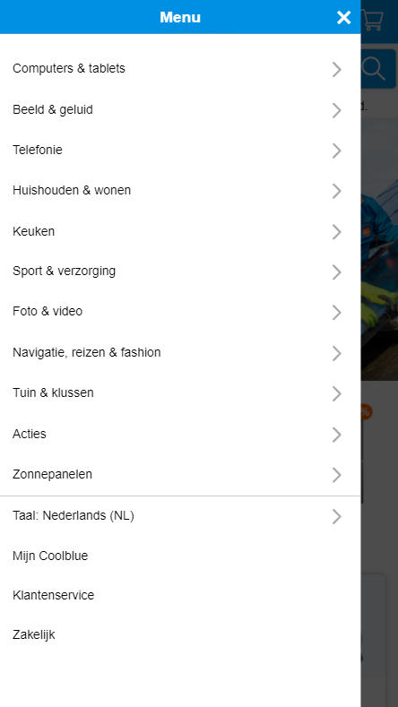
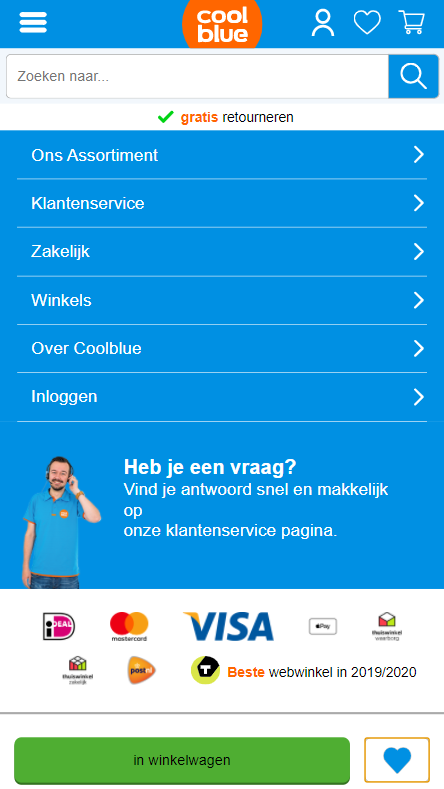
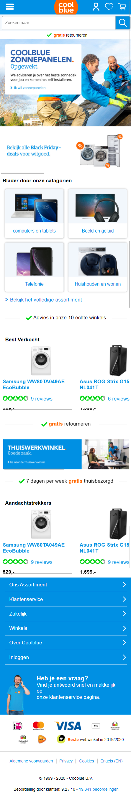
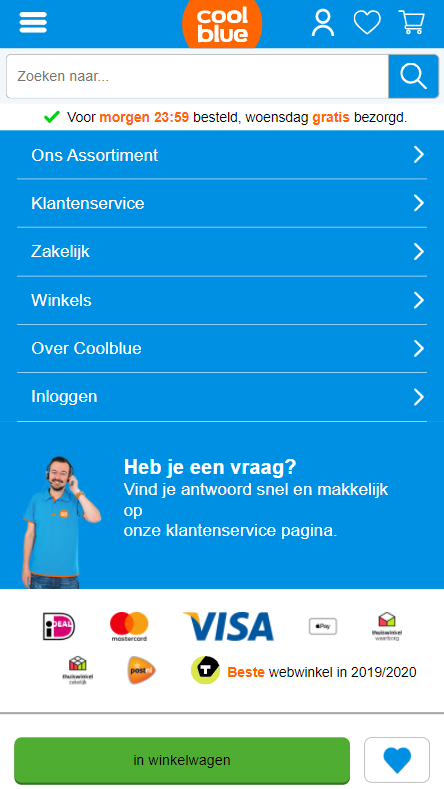
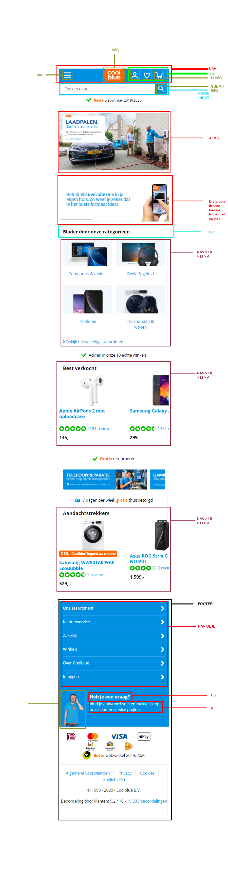

# Procesverslag
**Auteur:** Martijn

Markdown cheat cheet: [Hulp bij het schrijven van Markdown](https://github.com/adam-p/markdown-here/wiki/Markdown-Cheatsheet). Nb. de standaardstructuur en de spartaanse opmaak zijn helemaal prima. Het gaat om de inhoud van je procesverslag. Besteedt de tijd voor pracht en praal aan je website.

## Bronnenlijst
1. -bron 1-
2. -bron 2-
3. -...-

## Eindgesprek (week 7/8)

-dit ging goed & dit was lastig-

**Screenshot(s):**

-screenshot(s) van je eindresultaat-

## Voortgang 3 (week 6)

-same as voortgang 1-

## Voortgang 2 (week 5)

-same as voortgang 1-

## Voortgang 1 (week 3)

### Stand van zaken

-dit ging goed & dit was lastig-

**Screenshot(s):**

 Het toevoegen van de menu bar was even lastig. zo wou ik namlijk de animatie net zo precies maken als op Coolblue. Dit lukt me niet volledig en ik had even last er van dat de animatie meteen terug af speelde, wat ik met iets 'lastigere' java heb kunnen oplossen. Nu ben ik er wel tevreden mee.
 
 
 Het toevoegen van de animatie voor de wishlist button vond ik eigenlijk super makkelijk gaan! Ik wist al dat het trucje met @keyframe en display none er voor zou zorgen dat de animatie continue opnieuw zou afspelen wanneer je opnieuw klikt.

De code schrijven zelf vond ik niet bepaald lastig, dus dat was fijn!

**Hoe sta ik er voor?**
Dit is hoe ver ik op het moment ben. Naar mijn idee is de mobile design van pagina 1 volledig af, tenzij ik nog iets over het hoofd heb gezien, of the elementen niet juist zijn. Hier ga ik nog uitgebreid naar kijken.

Daarnaast heb ik een opzetje voor pagina 2. Hier ben ik nog niet zo volledig aan begonnen als pagina 1, maar ik heb wel de moeite genomen om alvast een 'add to wishlist' toe te voegen MET animatie.

### Agenda voor meeting

-samen met je groepje opstellen-

| student 1      | student 2          | student 3    | student 4        | student 5 |
| ---            | ---                | ---          | ---              | --- |
| dit bespreken  | en dit             | en ik dit    | en dan ik dat    | meer |
| an dat ook nog | dit als er tijd is | nog een punt | dit wil ik zeker | meer |
| ...            | ...                | ...          | ...              | ... |

### Verslag van meeting

-na afloop snel uitkomsten vastleggen-

## Breakdownschets (week 1)

## Intake (week 1)

**Je startniveau:** rood

**Je focus:** responsive

**Je opdracht:** coolblue.nl

**Screenshot(s) van de eerste pagina (small screen):**

**Screenshot(s) van de tweede pagina (small screen):**

