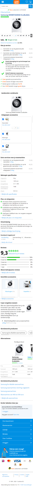
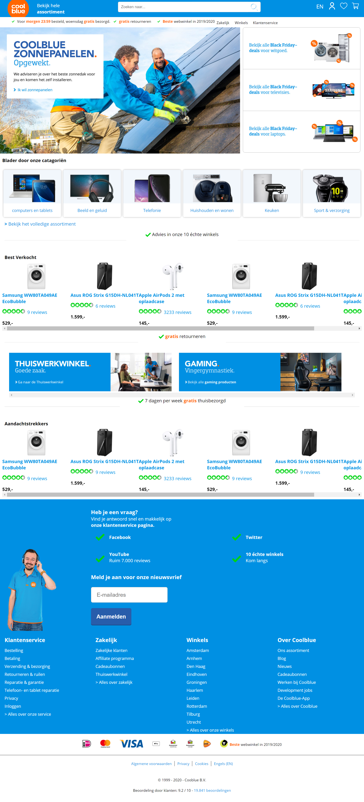
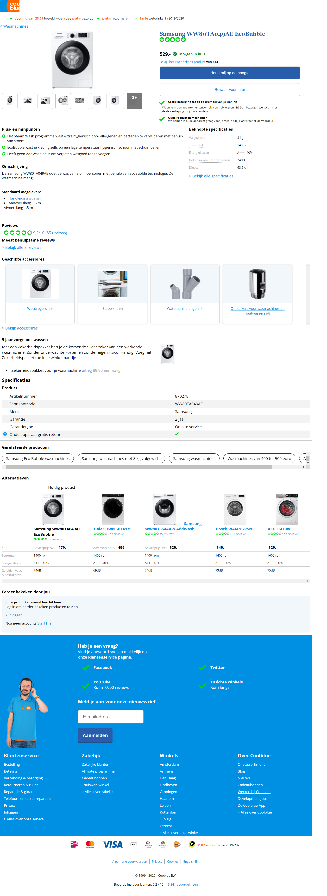

# Procesverslag
**Auteur:** Martijn

Markdown cheat cheet: [Hulp bij het schrijven van Markdown](https://github.com/adam-p/markdown-here/wiki/Markdown-Cheatsheet). Nb. de standaardstructuur en de spartaanse opmaak zijn helemaal prima. Het gaat om de inhoud van je procesverslag. Besteedt de tijd voor pracht en praal aan je website.

## Bronnenlijst
1. Afbeeldingen zijn geraadpleegd van Coolblue.nl

## Eindgesprek (week 7/8)

-dit ging goed & dit was lastig-

**Screenshot(s):**

In de vakantie heb ik mijn mobiele schermen af kunnen maken, wat super fijn was en ik ook niet echt lastig vond! Ik vond het superleuk om bij 'alternatieven' een table te moeten gebruiken, omdat ik hier niet vaak mee heb gewerkt! Het ging me wel makkelijk af dus dat was fijn!

Pas toen ik de schermen responsive moest maken werd het echt een drama. De index pagina was wel oké om te doen en had ik ook wel snel af, ondanks dat de footer echt een hele klus was. Ik vond het super vervelend om midden in een code nieuwe elementen toe te voegen omdat we gebruik maken van paden. Normaal kun je zo wat toevoegen, maar als je dat nu doet loop je nog wel eens het risico dat je hele code omslaat.

De detail pagina was echt CHAOS. Ik had het enorm lastig met sommige elementen te plaatsen op de juiste posities. Uiteindelijk ben ik van de indexpagina dan ook niet 100% tevreden met het resultaat.

## Voortgang 3 (week 6)

-same as voortgang 1-

In week 6 had ik eigenlijk niks extra's gedaan en had de voortgang voor mij dus ook niet veel nut.

## Voortgang 2 (week 5)

-dit ging doen & dit was lastig-

**Screenshot(s):**

Voor deze week had ik de index pagina een beetje onderschat en was ik er best laat aan begonnen. Hierdoor had ik maar de helf afgekregen voor deze feedback ronde.

Het schrijven van deze code vond ik iets lastiger dan de index, maar was nog niet heel moeilijk naar mijn idee!

...

### Verslag van meeting week 5

Ik kwam naar de meeting met het idee dat ik niet echt iets te vragen had. Dit heb ik ook niet gedaan. Na het laten zien van mijn werk heb ik het gevoel dat ik goed op weg ben.

## Voortgang 1 (week 3)

### Stand van zaken

-dit ging goed & dit was lastig-

**Screenshot(s):**

 Het toevoegen van de menu bar was even lastig. zo wou ik namlijk de animatie net zo precies maken als op Coolblue. Dit lukt me niet volledig en ik had even last er van dat de animatie meteen terug af speelde, wat ik met iets 'lastigere' java heb kunnen oplossen. Nu ben ik er wel tevreden mee.
 
 
 Het toevoegen van de animatie voor de wishlist button vond ik eigenlijk super makkelijk gaan! Ik wist al dat het trucje met @keyframe en display none er voor zou zorgen dat de animatie continue opnieuw zou afspelen wanneer je opnieuw klikt.

De code schrijven zelf vond ik niet bepaald lastig, dus dat was fijn!

**Hoe sta ik er voor?**
Dit is hoe ver ik op het moment ben. Naar mijn idee is de mobile design van pagina 1 volledig af, tenzij ik nog iets over het hoofd heb gezien, of the elementen niet juist zijn. Hier ga ik nog uitgebreid naar kijken.

Daarnaast heb ik een opzetje voor pagina 2. Hier ben ik nog niet zo volledig aan begonnen als pagina 1, maar ik heb wel de moeite genomen om alvast een 'add to wishlist' toe te voegen MET animatie.

### Agenda voor meeting

-samen met je groepje opstellen-

| Emma      | Jon          | Charlie    | Nine        | Martijn |
| ---            | ---                | ---          | ---              | --- |
| Waarop letten bij responsive  | w3c validator             | w3c validator    | w3c validator    | :nth-of-type |
| font probleem | header probleem | ... | background-image | ... |
| w3c validator            | ...                | ...          | ...              | ... |

### Verslag van meeting

Na mijn eigen vragen te hebben gesteld, is de enige info die ik heb gevraag ennodig heb gehad dat de main eventueel nog wel een id of class mag krijgen. Dit moet Iris alleen nog navragen.

## Breakdownschets (week 1)

## Intake (week 1)

**Je startniveau:** rood

**Je focus:** responsive

**Je opdracht:** coolblue.nl

**Screenshot(s) van de eerste pagina (small screen):**

**Screenshot(s) van de tweede pagina (small screen):**

